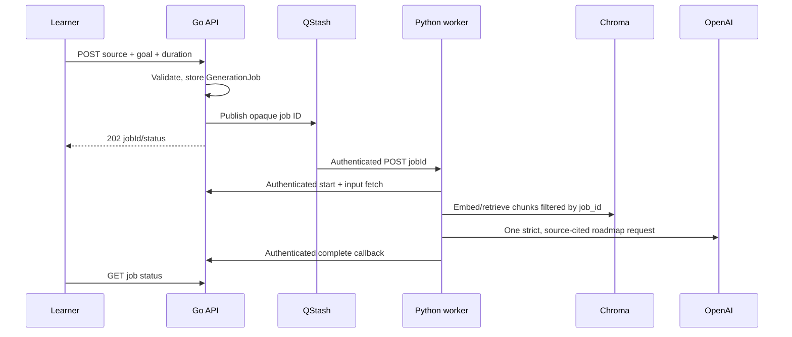

# Production RAG architecture

## Data and trust boundaries

- The client talks only to the Go API using its session cookie.
- Go owns authentication, input limits, job state, and roadmap persistence.
- Queue messages contain only `job_id`; source data stays in the protected database row during beta.
- Python receives source bytes only after presenting `INTERNAL_SERVICE_TOKEN` to Go.
- Chroma metadata includes `job_id`, `user_id`, `chunk_index`, `chunk_id`, source label, and PDF page where available. A retrieval query always filters by `job_id`.
- The model receives selected source chunks, never optional web content. It must return exact chunk IDs in each roadmap-day citation.

## RAG flow

1. Validate a duration of 1–180 days and normalize source documents.
2. Chunk with the configured splitter, hash stable chunk IDs, and embed batches into `curriculum_sources_v1`.
3. Retrieve a small candidate set filtered to the current job, deduplicate it, and apply a bounded context budget.
4. Make one OpenAI Responses API request with `store=False` and strict JSON Schema output.
5. Reject missing days, non-contiguous day numbers, placeholder topics, invalid task counts, and unknown citations before persistence.
6. Generate quizzes from the saved cited roadmap; quiz output also carries citations.

## Latency and cost controls

- No web scraping or topic-extraction LLM call is in the roadmap critical path.
- The request/worker boundary isolates upload latency from long-running extraction, embeddings, and model calls.
- OpenAI, Go HTTP clients, and worker-to-gateway calls use bounded timeouts and retries.
- Context and chunk limits are environment-configurable. Increase them only after a retrieval evaluation demonstrates a quality gain.
- Keep `OPENAI_MODEL` pinned during beta; test model changes against the evaluation set before rollout.

## Failure behavior

- Invalid sources fail before job creation.
- Queue publish failure preserves a failed job and returns a retryable error.
- Worker failure calls the protected fail endpoint; users can retry failed jobs.
- Completion locks the job row and stores at most one roadmap for a job.
